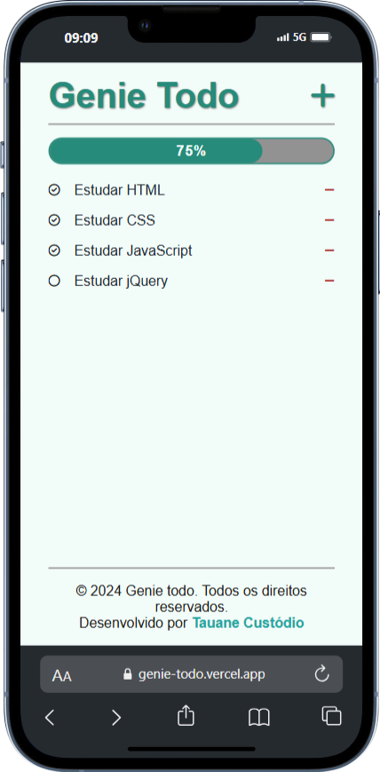
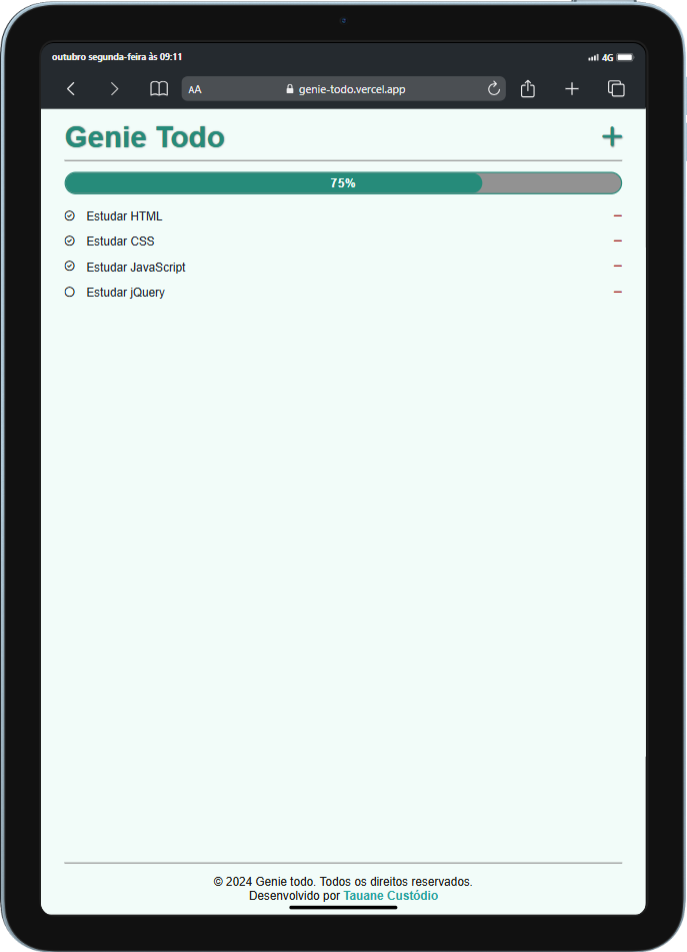
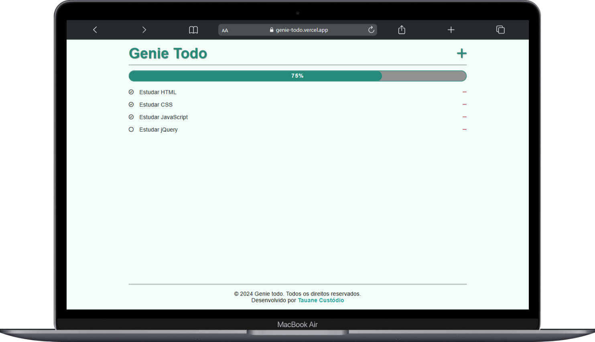

# Genie Todo
Genie Todo, é um site de gerenciamento de tarefas que permite aos usuários adicionar, visualizar e excluir suas tarefas.

Esse projeto faz parte dos projetos construídos no curso "Desenvolvedor FullStack Python"

## Índice
- [Genie Todo](#genie-todo)
  - [Índice](#índice)
  - [Screenshot e deploy](#screenshot-e-deploy)
  - [Tecnologias utilizadas](#tecnologias-utilizadas)
  - [Funcionalidades](#funcionalidades)
  - [Instalação](#instalação)
  - [Contribuição](#contribuição)
  - [Contato](#contato)
  
## Screenshot e deploy

[](https://genie-todo.vercel.app/)





## Tecnologias utilizadas
- HTML
- CSS
- JavaScript
- jQuery

## Funcionalidades
- Adiconar, visualizar e excluir tarefas
  - as tarefas são salvas no Local Storage, isso permite que as informações permaceçam disponíveis entre as sessões
- Marcar como concluida e ver barra de progresso
- Validação de tarefas já adicionadas não permitindo que se repita

## Instalação

Instruções sobre como instalar e configurar o projeto localmente.

```bash
# Clone o repositório
git clone https://github.com/tauanecustodio/genie-todo.git

# Navegue até o diretório do projeto
cd genie-todo

# Abra o arquivo index.html no seu navegador

```

## Contribuição

Sinta-se à vontade para contribuir com melhorias ou sugestões. Crie uma issue ou envie um pull request!

## Contato

[](https://www.linkedin.com/in/tauanecustodio/)